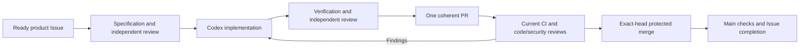

# Hydra

Hydra keeps delegated GitHub work moving through specification, implementation,
verification, code and security review, protected merge, and follow-up. Codex handles
reasoning; ordinary code handles GitHub waits and recovery.

Product repositories own goals, specifications, Issues, branches, PRs and CI. Hydra
has no operational repository, SQLite database, state branch, JSON journal or web
console. One active host runs one Codex turn at a time.

## Use

Install Python 3.11+ with the optional pinned Codex SDK into an isolated environment:

```sh
python3 -m pip install '.[codex]'
hydra status --repos owner/product
hydra run --issue https://github.com/owner/product/issues/12 \
  --workspace-root /absolute/owned/workspaces --host-alias development-mac
hydra serve --repos owner/product owner/another-product \
  --workspace-root /absolute/owned/workspaces --host-alias development-mac
```

The first runtime selects the existing `openboa` GitHub CLI account per operation and the existing ChatGPT subscription. It neither buys credits nor switches
to a paid model API. Configure the project's reviewed `.hydra.toml` on its protected
default branch and delegate a ready Issue using the [registration guide](docs/registration.md).

The host supplies owned workspace and storage prerequisites. Managed workspaces
require their registered lifecycle and storage providers; Hydra refuses an internal
disk fallback. Foreground and login-service execution use the same `serve` command.
Enable a login service only after actual delivery and recovery qualification.

## Workflow and recovery



A decision or CI wait releases capacity for another repository. Active external
waits are checked every 60 seconds; idle intake every five minutes. Unchanged state
does not trigger a model turn or repeated output.

One service-authored Issue comment records attempts, revisions, checkpoint, pending
action and next step. This directs recovery; actual branch/PR/CI/provider facts
authorize delivery. Restart reconciles effects before retry and never creates a
replacement PR because a response was lost. Unknown executions and foreign-host
attempts require confirmed shutdown, not heartbeat expiry. Unpushed work cannot be
recovered after host loss. See [the implementation contract](docs/engineering/github-workflow/spec.md).

## Status

The GitHub-native implementation replaces the earlier SQLite prototype. Deterministic
tests and authenticated runtime qualification are recorded in the
[verification record](docs/engineering/github-workflow/verification.md). These are
separate from actual two-project delivery, host handover and background activation.
The repository does not claim unattended operation merely because the CLI exists.

```sh
python3 -m unittest discover -s tests -v
```

See [CONTRIBUTING.md](CONTRIBUTING.md) for Hydra development. Product-agent evaluation
criteria stay in each product; Hydra does not lower them to report successful work.
