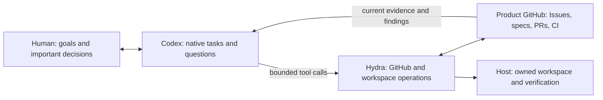
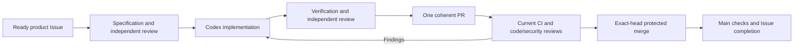

# Hydra

Hydra connects native Codex tasks to delegated GitHub work: specification,
implementation, verification, code and security review, protected merge and follow-up.
Codex selects work, proposes improvements, executes and asks questions. Hydra provides
deterministic tools; GitHub holds the product's durable records and delivery evidence.

Product repositories own goals, specifications, Issues, branches, PRs and CI. Hydra
has no operational repository, SQLite database, state branch, JSON journal or web
console. One active host admits one native assignment or supervised CLI worker at a time.

## Native Codex workflow

Use the [Hydra plugin](plugins/hydra) with one SDLC skill and five local MCP tools:
`hydra_status`, `hydra_begin`, `hydra_checkpoint`, `hydra_verify` and `hydra_deliver`.
See [native setup and recovery](docs/native-codex.md) for the pinned installation,
host settings and task contract. An MCP call never starts another model worker.



Questions stay in native Codex tasks. Record the publishable decision in the Issue
before resuming its exact attempt. Chat answers do not replace protected GitHub
reviews. Enable a native heartbeat after actual task, delivery and recovery
qualification; source installation alone does not establish unattended operation.

## Standalone CLI

Install Python 3.11+ with the optional pinned Codex SDK into an isolated environment:

```sh
python3 -m pip install '.[codex]'
hydra status --repos owner/product
hydra run --issue https://github.com/owner/product/issues/12 \
  --workspace-root /absolute/owned/workspaces --host-alias development-mac
hydra serve --repos owner/product owner/another-product \
  --workspace-root /absolute/owned/workspaces --host-alias development-mac
```

The first runtime selects the existing `openboa` GitHub CLI account per operation
and the existing ChatGPT subscription or available account credits. It neither buys credits nor switches
to a paid model API. Configure the project's reviewed `.hydra.toml` on its protected
default branch and delegate a ready Issue using the [registration guide](docs/registration.md).

The host supplies owned workspace and storage prerequisites. Managed workspaces
require their registered lifecycle and storage providers; Hydra refuses an internal
disk fallback. Foreground and login-service execution use the same `serve` command.
Enable a login service only after actual delivery and recovery qualification.

## Workflow and recovery



A decision or CI wait releases capacity for another repository. Active external
waits are checked every 60 seconds; idle intake every five minutes. Unchanged state
does not trigger a model turn or repeated output.

Native ready, paused and decision labels control delegated work; `hydra:active`
keeps unfinished work and interrupted completion cleanup discoverable. Open intake
and closed active recovery are queried separately, without scanning closed history.
Labels do not establish successful checks, reviews or merge.

One service-authored Issue comment records attempts, revisions, checkpoint, pending
action and next step. This directs recovery; actual branch/PR/CI/provider facts
authorize delivery. Restart reconciles effects before retry and never creates a
replacement PR because a response was lost. Unknown executions and foreign-host
attempts require confirmed shutdown, not heartbeat expiry. Unpushed work cannot be
recovered after host loss. See [the implementation contract](docs/engineering/github-workflow/spec.md).

The existing OS lock retains a boot identity and one unresolved launch nonce.
It blocks restart after an uncertain execution even if its wrapper has disappeared;
confirmed cleanup clears it. Native assignments add a fixed scope digest to bind
their repository, Issue, attempt, head and policy. The ticket contains no workflow
history or result. Native tickets survive reboot until explicit stopped reconciliation.
Write results are committed and recorded as restartable checkpoints before retirement.
Native included
permission or explicit credit availability with spend permission permits a turn
attempt; Codex accepts or rejects execution. Unknown usage and workspace denials
hold without purchases or billing fallback. Credit attempts currently require
availability in every selected quota bucket, so an additional bucket without credit
information conservatively waits.

## Status

The GitHub-native implementation replaces the earlier SQLite prototype. Deterministic
tests and authenticated runtime qualification are recorded in the
[verification record](docs/engineering/github-workflow/verification.md). These are
separate from actual two-project delivery, host handover and background activation.
The repository does not claim unattended operation merely because the CLI exists.

```sh
python3 -m unittest discover -s tests -v
```

See [CONTRIBUTING.md](CONTRIBUTING.md) for Hydra development. Product-agent evaluation
criteria stay in each product; Hydra does not lower them to report successful work.
