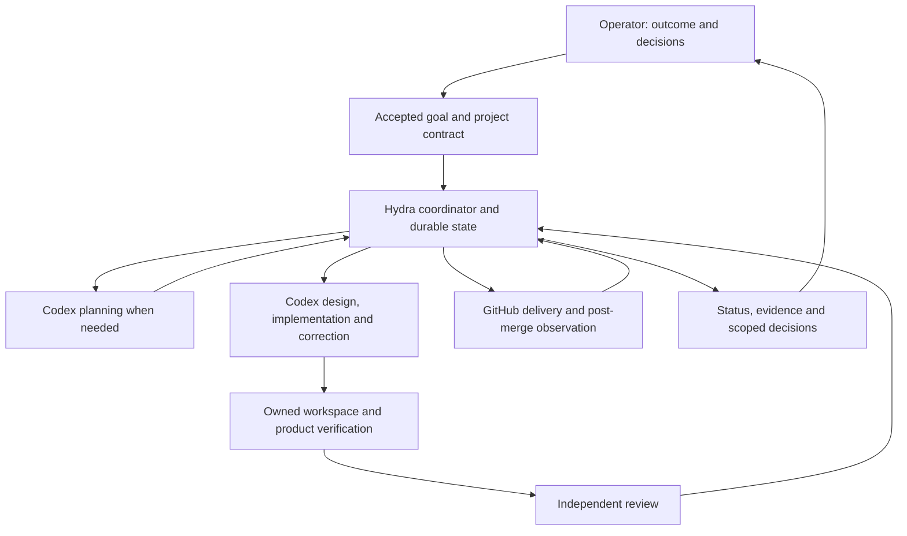

# Hydra v1 — delegated development through verified outcomes

Status: Proposed for independent review. Acceptance of this specification does not establish
installation, autonomous delivery, or operational reliability.
Work record: https://github.com/openboa-ai/hydra/issues/3

## 1. Outcome and scope

The operator defines a result, priorities and delegation boundaries once. Hydra converts that
intent into bounded work, keeps implementation, verification and review corrections moving,
delivers eligible changes, observes their result, and continues toward the goal. The operator
sees why work happens and intervenes on actual decisions rather than restarting every stage.

The acceptance unit is a delegated episode:

`goal -> work selection -> reviewed spec -> implementation -> verification -> completed reviews
and corrections -> delivery -> observation -> next work / justified wait / decision / goal acceptance`

A PR, green CI, model completion, daemon startup or setup checklist alone is not that outcome.
Hydra is the SDLC control plane. Product requirements and product-agent quality belong to each
project; Hydra evaluates how effectively it delivers those requirements without lowering them.

v1 uses one logged-in host, one coordinator, official local Codex execution with the existing
subscription, GitHub, SQLite, and a CLI. The existing Codex conversation is an operator surface,
not a process that must live forever. Public software and private installation data are separate.
No new model API, web console, broker, distributed worker system, GitHub App, permanent team of
agent processes, or plugin framework is needed. MCP may wrap the same commands later.

## 2. Roles, functions and authority

| Component | Owns | Input -> output | Does not own |
| --- | --- | --- | --- |
| Operator | Outcome, priority, delegation and material decisions | Intent -> accepted goal/decision | Repeated routine restart instructions |
| Domain/store | Work, dependencies, ownership, waits, evidence, effects | Accepted records/observations -> transactional state/history | Product requirements or external truth |
| Coordinator | Reconciliation, eligibility, scheduling, resource claims, continuation and recovery | Current state/events -> action or explicit wait | Semantic product design |
| Codex adapter | Identified start/resume/interrupt, events, questions, usage | Assignment -> events and proposed outcome | Goal completion or delivery permission |
| Workspace/verification adapter | Owned isolation, configured commands, raw artifacts | Project/revision -> execution evidence | Quality thresholds |
| GitHub/delivery adapter | External reads, publishing, review tracking, eligible merges and read-back | Validated intent -> observed result | Rule bypass or human impersonation |
| Operator interface | Status, decisions, pause/cancel/resume and meaningful notifications | Same state -> CLI/Issue view | A second workflow state machine |
| Product verification | Product tests, agent evals, runtime behavior and acceptance criteria | Product requirements -> results | Hydra reliability assessment |
| Hydra evaluation | Whole-episode quality, recovery and intervention comparison | Versioned episodes -> improvement evidence | Product passing criteria |

These are modules in one application. Planning, implementation, review and diagnosis are Codex
assignment roles invoked when useful, not permanent services. A planner proposes work linked to
an unmet goal requirement. An implementer creates a candidate. An independent reviewer examines
the actual spec, diff and execution evidence. Diagnosis changes an approach after bounded failure.
A reviewer is not a separate security principal or an authenticated human approver.

## 3. Canonical state and records

| Information | Canonical source | Hydra representation |
| --- | --- | --- |
| Goal/delegation/material decisions | Designated durable operating Issue at an accepted revision | Immutable source identity and accepted snapshot |
| Requirements/spec/quality policy | Product Git revision | References and scoped context |
| Work/ownership/attempts/waits/pending effects | SQLite | Transactional state and append-only transition/effect audit |
| Code/CI/review/merge/deployment facts | GitHub and actual target | Timestamped observations, refreshed before delivery |
| Logs/screens/test output | Private artifact files | Locator, hash, producer and input revisions |
| Knowledge used | Referenced knowledge revision | Bound at task start/replanning, not changed during execution |
| Issue progress/Codex summary | Projection of the above | No independent editable status authority |

Goal source edits require reconciliation; arbitrary Issue text or labels never grant authority.
Only an explicitly accepted structured goal revision is executable. CLI goal/delegation changes become effective
after durable publication and acceptance are confirmed. A failed publication leaves intent only.
Progress updates do not alter the accepted goal revision. Private operation records never default
to a public product Issue. Repository numeric identity is stored alongside its name: recreating a
repository under the same name cannot adopt old work, evidence or authority.

Local pause/cancel commands take effect without waiting for Issue publication; their later durable
projection cannot delay stopping execution.

Minimal records:

- **Project:** repository identity/default branch, accepted contract, spec references, workspace
  provider, verification/review/check policy, delivery effects, resources.
- **Goal:** source/revision, desired result and requirement IDs, priority, discovery/execution
  scope, exclusions, budget/stop conditions, completion evidence.
- **Work:** goal requirement links, why now, repository, dependencies, scope/spec, phase/status,
  workspace/branch/PR, intended delivery, row revision.
- **Run:** work/goal, role, ownership generation, thread/turn/process identity, input revisions,
  checkpoint/terminal status, observed usage and proposed outcome.
- **Wait:** reason, exact subject, resume predicate, last observation, next check/reset time.
- **Evidence:** requirement/type, spec/head/base/policy/environment, producer, raw result, outcome,
  time and validity. Missing or stale evidence does not satisfy a condition.
- **Decision:** affected scope/revision, facts, options/effects, recommendation, allowed actor and
  accepted response reference.
- **Effect:** work/run/generation, operation/target, expected revisions, intent digest,
  pending/unknown/confirmed/failed state and external receipt.

SQLite uses foreign keys, schema versions and transactions. One OS coordinator lock plus
transactional claims prevents competing dispatch. Current tables plus an audit log are enough;
full event sourcing is unnecessary. Use SQLite consistent backups, including WAL state. On DB
corruption/loss, stop dispatch and recover recorded state; never reconstruct pending writes from
chat summaries and immediately retry.

## 4. Registration and work selection

A project contract validates repository identity, accepted specs/policy, execution setup, isolated
workspace lifecycle, verification commands and actual behavior evidence, review providers,
workflow/job identity, merge/integration protection, preview/production effects and resources.
Commands are argument arrays with cwd/timeout; untrusted Issue text is never interpolated into
shell programs. Reuse the host's existing worktree/storage lifecycle through a provider adapter.
A second project changes configuration, not the common coordinator. Cross-repository goals use
separate change Work records and explicit integration evidence.

Missing capability means observe-only with exact missing conditions, not enabled autonomous
operation. Existing PRs/workspaces are observed until explicit ownership handover. A goal needs
observable outcomes, priority, exclusions and delegation. Missing product intent creates a
planning decision; Hydra does not invent features just to fill a queue.

**Planning loop (Codex):** run on accepted goal change, meaningful completed dependency, material
new fact, repeated failure, or unfinished goal with no eligible work and no recorded wait.
Coalesce equal input fingerprints. Unchanged waits cannot repeatedly replan. Output is bounded
work with requirement/why-now/evidence/dependencies/scope/resources, a technical replan, a scoped
decision, or an explicit wait. Validate schema, revision, dependencies, scope and resources;
independent design review assesses semantic contribution and acceptance adequacy.

**Execution loop (code):** observe -> reconcile -> select -> reserve -> record intent -> dispatch
-> validate result -> transition/wait. Selection favors uncertain-effect recovery and finishing
current delivery, then dependency unblockers, accepted priority, and oldest eligible project.
One blocked task does not stop unrelated ready work. CI/review completion resumes existing work;
it normally does not invoke a portfolio planner.

Codex events drive run handling. Model-free GitHub polling initially checks active waits every
60 seconds and otherwise every five minutes, with jitter/rate-limit backoff. A webhook can later
feed the same path; reconciliation remains necessary. Do not wake a model periodically to ask
whether anything changed. Local host/login availability remains a condition of operation.

## 5. Execution contract

Assignments carry work/run IDs, generation, role, goal/project/spec/policy revision, expected
repo/base/head, owned workspace, context, reason, allowed actions, required output/evidence,
budget and checkpoint. Results are candidate-ready, waiting-external, needs-decision, failed or
cancelled, with artifacts, requirement coverage, unresolved issues, next action and usage.
A result proposes a transition; Hydra checks ownership and actual evidence before accepting it.

| Phase | Action | Exit condition |
| --- | --- | --- |
| Design | Reuse accepted spec or write/review scoped spec | Accepted revision within delegation, no unresolved material boundary |
| Implement | Code, meaningful tests, local verification | Candidate revision with required evidence |
| Verify/review | Product checks, runtime evidence, independent semantics, PR code/security reviews | Current evidence, completed reviews, resolved blocking findings |
| Deliver | Re-query revisions/policy/checks/reviews/decisions/effects | Eligible exact-head merge and actual result confirmed |
| Observe | Merge-revision CI and registered smoke/preview/runtime check | Work's stated completion evidence |

Status is ready/running/waiting/paused/completed/cancelled. Waits name CI run, review head,
decision revision, quota reset, auth, storage, or recovery and the event needed to resume.
Pausing stops new dispatch and checkpoints running work. Cancellation fences further actions,
interrupts the owned run, and reconciles already-submitted effects. Requested stop is not a
confirmed stopped process. A completed model turn is not a completed Work.

Limits: two development Work records globally, one change Work per repository. A Work waiting
for review keeps the repository lane but releases its model slot. At most two local model turns
including planner/reviewer/diagnosis; nested model fan-out is disabled until accounted for.
Remote review jobs have separate usage/admission accounting. The initial live trial uses one Work.

Closing every Work does not complete a Goal. An acceptance review checks goal outcomes and
cross-work integration evidence, then proposes achieved, next work, wait or a scoped decision.
The coordinator requires that evidence rather than counting closed PRs.

## 6. Verification, reviews and automatic delivery

Product checks produce execution facts. Independent review judges semantic fulfillment.
Hydra admission matches current facts against accepted policy. None substitutes for the others.
Code/security reviews run at a coherent PR boundary, after local evidence, not on every edit.
The provider adapter must identify a completed result for the exact reviewed head and distinguish
pending, failure, findings and no-findings. A request comment, reaction, label, bot name or absence
of findings is not completion. Unknown output is a capability failure, not inferred success.
Findings need recorded disposition and verified corrections; new head invalidates affected
verification/review. Native human review requirements are respected without impersonation.
UI changes expose actual screen evidence to the operator before final PR publication; this is an
evidence checkpoint, not another routine approval.

Automatic merge requires current delegation/spec/policy/ownership; current requirement evidence
and independent review; completed required code/security reviews; no unresolved blocking finding,
change request or thread; trusted required workflow/job results; protected-path decisions; native
integration protection; and no unapproved production/release effect triggered by merge.

Check provenance includes workflow/source revision, event, target commit and required jobs, not
only name or Actions App. Candidate-written pass files do not establish success. Candidate execution
gets no production secrets or verification-result writing credentials. Checker source/execution
boundaries must be validated. Protect workflow/policy/evaluator/holdout/threshold/CODEOWNERS changes;
ordinary unit-test changes inside accepted scope remain automatic.

Merge binds the expected head; reading the base immediately beforehand is not an atomic base
binding. Strict up-to-date required checks or a qualified native merge queue provide integration
protection. Prefer supported native async merge with recorded result ID; a synchronous exact-head
call with read-back is a qualified fallback. Enqueued/HTTP-accepted is not merged. Verify the actual
PR merged state/merge SHA; attach post-merge results to that SHA. Merge, verified preview and
production deployment remain separate facts. Inspect hosting integrations as well as workflows.

## 7. Recovery invariants

External writes use durable intent -> attempt -> observed confirmation. Stable work branch and
marker identify an existing PR. Every action validates repository identity and expected revisions.
An unknown result must be reconciled before retry. Generation fences apply to Hydra-managed
writes/state; they do not magically fence arbitrary shell access outside Hydra.

| Failure/event | Required behavior |
| --- | --- |
| Duplicate signal | Dedupe identity/fingerprint; one transition |
| Push response lost | Read remote branch; compare exact SHA |
| PR response lost | Find exact source repo/branch and work marker; adopt one, report multiple as conflict |
| Merge response lost | Read native result/PR/merge SHA; keep unknown until established |
| Restart | Lock, load state, reconcile effects and old runners/workspaces, then dispatch |
| Missing/ambiguous runner | Hold affected work; do not reuse workspace or steal by timeout |
| Confirmed terminated runner | Preserve checkpoint, reconcile effects, increment generation, resume |
| Cancel/handover/late result | Interrupt owned process; reconcile outstanding effects; reject stale generation for new actions |
| Changed head | Invalidate head-bound evidence/review |
| Changed base | Refresh integration evidence; preserve compatible accepted spec |
| Changed goal/policy/spec | Re-evaluate affected scope; never widen authority silently |
| Auth/storage unavailable | Exact resource wait; no hidden account/disk fallback; unrelated capable work proceeds |
| Transient infrastructure error | At most two retries with backoff and input/failure fingerprint |
| Same failure three times | Diagnose/replan; stop identical correction loop |
| Direct human branch/PR change | Reconcile facts and conflict; preserve changes |

Timeout requests interruption/diagnosis; it does not prove process death. Store process start
identity as well as PID. A single Work has one active mutable Run and exclusive workspace/resource
ownership. Unknown writes and unresolved runs prevent ownership transfer even after a timeout.

## 8. Decisions, resources and authority

Implementation, tests, CI fixes, review corrections, technical replans, and security repairs
restoring accepted behavior proceed within delegation. Ask only for unresolved product choices,
policy/authority/data/evaluation changes, new credentials/spend, production/public release or an
exception. Ask with decision ID/scope/revision, evidence, options/impacts, recommendation and
independent work that continues. Reuse prior answers inside their accepted scope.

Subscription windows, credits, local runner limits, GitHub review allowance and API rate limits
are separate resources. A local quota percentage cannot diagnose unusable review credits. An
optional 20% subscription reserve is an operator preference, not a provider outage. Missing usage
can defer new budget-dependent runs while observation continues. Account checkpoint/recovery
separately. No automatic purchases, resets, paid API switch or alternative accounts. Unknown
cost/operator time is null, not zero.

Retain the current authorized account; authentication does not expand delegation. Restricted
Hydra adapters are not hostile-worker containment when same-user shells retain broader access.
State that limitation. Do not copy credentials to workspaces/public CI/logs or impersonate human
approvals. Stronger host isolation needs separate measured qualification, not repeated speculative
credential setup before ordinary work.

Install a verified fixed Hydra revision outside candidate worktrees. Updating its code/policy is
normal reviewed work, not immediate self-modification. Checkpoint/drain, consistent backup,
fixture/limited-run checks, compatible migration, explicit promotion and recoverable old version
are required. Filesystem location alone is not an OS security boundary.

## 9. Runtime and operator interface

Choose Python 3.11+, SQLite and one coordinator. Use `openai-codex==0.162.0` and its pinned local
runtime after contract tests. Do not depend on the desktop app's private binary/DB/socket or assume
SDK threads appear automatically in its conversation list.

Initial worker profile: explicit workspace sandbox and `ApprovalMode.deny_all`; never use SDK
approval defaults as authorization. Product/policy questions become a structured needs-decision
outcome; stop the turn and resume after a recorded response. Native permission expansion is not
automatically accepted. Use a narrowly pinned lower-level read-only request for account limits
with an explicit rejecting approval handler. Do not block the transport reader waiting for a human.
If live pending native approval becomes required, separately qualify a narrow app-server stdio
adapter rather than patching private SDK internals. Worker ability to perform the registered
build/verification commands must be demonstrated before enabling that project.

Persist start intent, then thread/turn IDs immediately. Stream events once; terminal provider
status and domain completion are separate. Reconcile lost responses/transport before another
mutable run. Forward external reviews as lower-trust tool material, not new user authority.
Keep bounded artifacts and references across resumption rather than one growing master prompt.

One command layer supports CLI and optional future MCP:

- `project check/register`: capabilities, prerequisites and accepted contract.
- `goal import/show`: bind accepted durable goal and show unmet requirements.
- `status`: goal, work/reason, phase, evidence, delivery, next action, decision and resources.
- `run --once` / `serve`: one reconciliation cycle or the same ongoing loop.
- `pause/resume/cancel`: named scope, expected revision and owned execution.
- `decision record`: authorized response tied to requested revision.
- `doctor`: version/auth/storage/state/rules checks without starting work.

No arbitrary GitHub API proxy or completion override. State/effect commands carry expected
revision and ownership. JSON and human output represent the same records. Only allowlisted
progress fields go to public Issues; private transcripts are not uploaded automatically.

Qualify start/resume/interrupt/terminal, questions, usage/error classification, disconnect and
restart without duplicate execution, workspace ownership, actual review-result formats,
exact-head merge and post-merge observation. Documented, fixture-tested and live-demonstrated
capabilities are separate. Missing capability is reported, not silently approximated.

## 10. Observation and improvement

Display goal -> work and why -> phase -> valid evidence -> PR/merge/preview/production -> next
action/wake condition -> decision -> resource wait. Record operation IDs, revisions, timestamps,
producers and failure categories for diagnosis. Notify completion, meaningful failure and needed
decision; unchanged polling creates no comment/alert. Use existing operator channels for a daily
summary. A model-free external liveness check follows an actual service installation and separates
planned pause from outage; scheduler timing is not a strict SLA.

Hydra eval combines deterministic reliability regressions and capability episodes. Test duplicate
ownership, stale evidence, unknown writes, cancellation, restart, wrong completion, decision scope
and authority; separately compare planning, useful delivery, review correction and unnecessary
intervention. Record code/policy/prompt/model/runtime/tool/environment/task/grader revisions.
Separate improvement cases from validation samples. Product criteria or grader leniency changes
are not workflow gains. Measure unassisted eligible completion, eligible waiting including tasks
never started, repeated user instructions versus necessary decisions, rework/regressions and
observed time/usage per verified result.

## 11. Delivery slices and acceptance

| Slice | Result | Required evidence |
| --- | --- | --- |
| S0 | Finish existing repository foundation | Actual fixtures, current CI, completed code/security reviews, normal merge, post-merge check |
| S1 | Durable execution and operator status | Actual bounded Codex run; saved IDs; wait/resume; duplicate/cancel/restart fixtures |
| S2 | One real delivered Work | Coherent PR through both reviews, correction, exact-head merge and post-merge verification |
| S3 | Continuous delegated Goal | Generate/complete Work; next action; one decision preserves independent progress |
| S4 | Common workflow across projects | Second different real project, configuration-only adaptation and recovery |
| S5 | Installed operating pilot | Pinned startup/recovery; 14-day observation targeting 10 eligible tasks, actual sample stated |

These slices are implementation dependencies, not repeated requests to redesign. S1/S2 can use
Hydra's real development needs. Do not create cosmetic PRs to fill a sample. Product goals remain
owned by their projects; fixtures qualify mechanisms but are not real multi-project operation.

Mandatory negative acceptance: duplicate run/PR prevention; unknown-write read-back; late worker
rejection; changed head/base; forged or absent checks/reviews; checker suppression; unauthorized
production effect; correct auth/storage/quota waits; isolated human decision; false goal completion.

Report foundation, execution readiness, autonomous delivery, multi-project qualification and pilot
completion separately. Project-start readiness requires a real delegated episode and recovery;
the pilot measures reliability afterward rather than blocking use for an arbitrary calendar period.
Do not claim production operation without testing it.

## 12. Research rationale

Sources inform the architecture; reported results do not prove Hydra's performance.

- [Stripe Payment Method Factory](https://stripe.dev/blog/stripes-payment-method-factory-orchestrating-agents-for-repeated-custom-integrations): use code for predictable coordination and model judgment for planning.
- [OpenAI harness engineering](https://openai.com/index/harness-engineering/): execution needs actual app behavior and observability, not merely more instructions.
- [Anthropic AI-native SDLC](https://claude.com/resources/articles/the-ai-native-sdlc-playbook): preserve versioned intent/artifacts. Routine agent acceptance of detailed design is Hydra's delegation choice, not a universal claim from this source.
- [Anthropic agent evals](https://www.anthropic.com/engineering/demystifying-evals-for-ai-agents): assess harness and agent together against actual outcomes, with capability and regression samples.
- [Codex SDK](https://learn.chatgpt.com/docs/codex-sdk), [pinned SDK reference](https://github.com/openai/codex/blob/rust-v0.162.0/sdk/python/docs/api-reference.md), and [app-server](https://learn.chatgpt.com/docs/app-server): reuse official execution and qualify exact supported controls.
- [GitHub merge API](https://docs.github.com/en/rest/pulls/pulls#merge-a-pull-request-asynchronously) and [protected branches](https://docs.github.com/en/repositories/configuring-branches-and-merges-in-your-repository/managing-protected-branches/about-protected-branches): reuse native integration enforcement and confirm actual external delivery.
